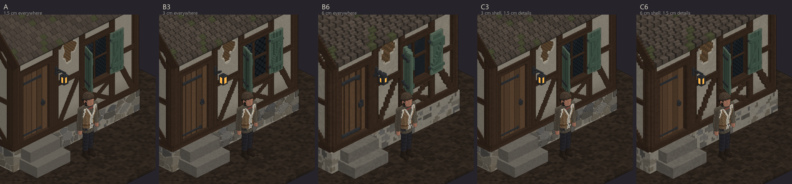
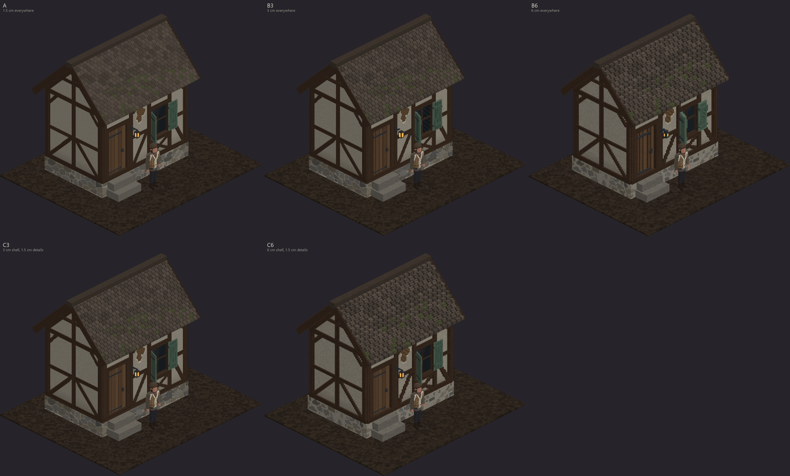
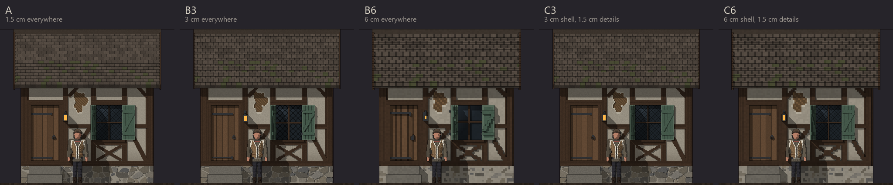
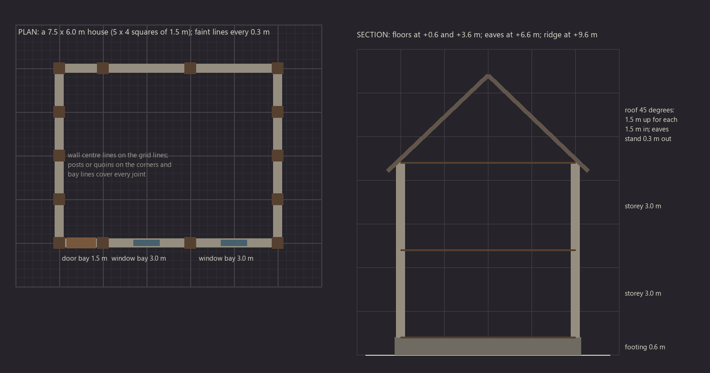

# The environment's voxel size: a scale study

Agent E, 2026-09-30. For Peter's decision before the village kit (E01) is built. The E01 brief is in the library:
`E:\Assets\DND5E\pixel3d\plan\briefs\E01_village_kit.md`.

**In short.** At the distance the game is played from, 1.5 cm and 3 cm buildings look almost the same beside our 1.5 cm
people; 6 cm looks blocky. I recommend building the village's architecture at 3 cm, and everything that opens, hangs
or is handled at 1.5 cm (doors, shutters, windows, signs, gates, lanterns, and all props, as the kit builds them now).
That is Hytale's own split: it draws its characters at twice the pixel density of its world. It costs about half the
triangles, a quarter of the texture and an eighth of the voxels of doing everything at 1.5 cm. Whatever size you pick,
the export has to change: today's GLB, one quad per voxel face, can't carry a village.

## What I built

A small half-timbered cottage, built with the library's own `vox.Grid` (its box and cylinder shapes and its paint
rules) in my scratch folder, never the library:
- 4.5 × 3.0 m, one 3.0 m storey on a 0.6 m stone footing, under a 45° shingled roof;
- a plank door with strap hinges and a ring pull, up two stone steps;
- a leaded window with two shutters, one swung out at an angle, one laid back flat against the wall;
- a lantern on an iron bracket;
- braces in the panels, a St Andrew's cross under the window, knee braces under the head plate;
- mud splashed up the plaster, rain streaks under the sill, and a patch where the plaster has fallen away to the wattle.

It is built in two layers:
- the **shell**: footing, walls, frame, roof, steps;
- the **details**: door, shutters, glass and glazing bars, lantern.

The mixed options put a 3 or 6 cm shell with 1.5 cm details, fitted to the openings the shell really builds.

Sizes are written in centimetres and snapped to each voxel size, the way an artist would:
- a feature never drops below one voxel, so at 6 cm the 3 cm timber relief becomes 6 cm, and the shutter boards about
  9 cm thick;
- surface relief under half a voxel is dropped, so at 6 cm the stone joints are colour only;
- leaded diamonds need about six voxels each: 12 cm at 1.5 cm, 18 cm at 3 cm, none at 6 cm.

Beside the cottage stands the kit's Barovian commoner (review 3's approved look). He is a 1.8 m man, and 126 voxels
(1.89 m) to the top of his cap. He is built in memory from his library recipe.

The pictures are flat projections made with numpy and PIL, with no Blender:
- a front elevation, with a low sun from the upper left so that relief casts shadows;
- an isometric view from the front left (turned 45°, looking down 30°), where each layer draws its faces at its own
  voxel size.

The shading is flat, so judge the pictures for grain and shape, not for lighting.

The five options:

| Option | Shell | Details |
|---|---|---|
| A | 1.5 cm | 1.5 cm |
| B3 | 3 cm | 3 cm |
| B6 | 6 cm | 6 cm |
| C3 | 3 cm | 1.5 cm |
| C6 | 6 cm | 1.5 cm |

## The pictures

All in `env_scale\`.

**Close zoom, the same corner in all five** (the man about 220 px tall):

**Play zoom:** v2's default camera, where agent A measured about 1.7 screen pixels per 1.5 cm voxel at 1080p
(`engine_decision.md`). The man is about 185 px tall. The pixels are 1:1, anti-aliased:

**The front, 1 pixel per 1.5 cm:**

The other pictures:
- `detail_crops.png`: the window, the door, the roof and the footing at 3 pixels per 1.5 cm, all five options;
- `iso_far_zoom.png`: zoomed out to half the play zoom (the man about 90 px);
- `iso_A.png` … `iso_C6.png`: each option whole, close zoom;
- `elevation_A.png` … `elevation_C6.png`: each front view at 2 pixels per 1.5 cm;
- `lod_chain.png`: option A downsampled to 3 and 6 cm, as automatic LODs;
- `snap_grid.png`: how the kit snaps (see below).

## The look

- **At play zoom, A, B3 and C3 are hard to tell apart.** B6 and C6 read blockier: the roof turns into a relief of 6 cm
  steps, the braces stair-step in 6 cm jumps, and the footing's stones become blotches.
- **Close up, the differences are in the small things.**
  - At 1.5 cm, the lantern has a frame and a hook, the door has plank joints and a ring pull, the glass has leading,
    the stones have sunken joints, the shingles have fine courses, and the fallen plaster shows the weave.
  - At 3 cm, all of that is still there, only coarser.
  - At 6 cm, most small things shrink to one or two voxels. The lantern becomes a lump, the ring pull a dot, the
    shutters 9 cm slabs, and the leading goes.
- **Grain against the figure.** The man is built at 1.5 cm.
  - At 3 cm the walls' grain is twice his: you can see it close up if you look, and you can't at play zoom.
  - At 6 cm it is four times his, and the house reads as a different model. Pixel artists call this "mixels", the
    fault of mixing pixel sizes in one picture.
- **The mixed options.**
  - C3 keeps what the eye goes to (the door, the shutters, the lantern, the window) at the figure's grain, on 3 cm
    walls. It looks like A until you study the stones and the shingles.
  - C6 puts fine pieces on blocky walls, and the join shows.
- **Hytale, our reference, mixes on purpose.** Its characters and what they carry (tools, weapons, food, cosmetics) are
  drawn at 64 pixels per block. Its blocks and props are drawn at 32, half the density. Its artists say the higher density
  helps characters detach from the environment and makes the scene easier to read. Source:
  [An Introduction to Making Models for Hytale](https://hytale.com/news/2025/12/an-introduction-to-making-models-for-hytale)
  (hytale.com, December 2025). B3 and C3 have the same 2:1 ratio; A has 1:1.

## The numbers: the cottage

| Option | Voxels | Open faces | Triangles, exported as today | Triangles, greedy + atlas | Atlas texels (RGBA, with mipmaps) | Build time | Peak memory |
|---|---|---|---|---|---|---|---|
| A | 7.33 M | 1.01 M | 2.0 M (154 MB GLB) | 42,440 | 1.01 M (5.4 MB) | 10.2 s | 2.5 GB |
| B3 | 0.92 M | 248 k | 496 k (38 MB) | 21,038 | 0.25 M (1.3 MB) | 1.3 s | 0.35 GB |
| B6 | 0.12 M | 62 k | 124 k (9.5 MB) | 6,806 | 0.06 M (0.3 MB) | 0.2 s | 0.07 GB |
| C3 | 0.96 M | 282 k | 564 k (43 MB) | 21,992 | 0.28 M (1.5 MB) | 1.4 s | 0.35 GB |
| C6 | 0.17 M | 104 k | 208 k (16 MB) | 8,234 | 0.10 M (0.6 MB) | 0.3 s | 0.10 GB |
| The man, for scale | 34.8 k | 15.2 k | 30 k (2.3 MB) | 8,746 | 15.2 k | 1.3 s | small |

What the columns mean:
- **Open faces** are the voxel faces that touch air. Today's exporter (`render_vox.py`) turns each one into its own
  quad. I measured 152 bytes per face on the commoner's `model.glb`.
- **Greedy + atlas** merges every flat run of open faces into one rectangle, whatever their colours, and keeps the
  colours in a texture, one texel per voxel face. That is what makes voxel buildings cheap.
- **Merging only faces of the same colour (vertex colours) barely helps.** The kit gives every voxel a slightly
  different shade, so A's shell only drops from 967 k faces to 873 k quads, not to 20 k. A 255-colour palette (as in
  MagicaVoxel) does no better: 844 k.
- **Build time and memory** are for shapes painted only inside their own bounding boxes. Painted the kit's way (every
  shape evaluated over the whole grid), the same shell took:
  - 3.9 s at 6 cm (0.15 GB peak);
  - 31.8 s at 3 cm (0.95 GB);
  - 275 s at 1.5 cm (7.4 GB).

  Both ways give the same voxels; I checked at 6 and 3 cm.
- **How the costs grow as the voxel halves:** merged quads about 2 to 3 times (they follow steps and edges), faces and
  texels 4 times, voxels 8 times.

## Scaling up to the village

A two-storey village house (7.5 × 6 m footprint, 10 m to the ridge) has about three times the cottage's surface. The
village as dungine.v2 builds it comes to about 100 cottages' worth of surface: 17 houses, the tavern, the shop, the
manor, the church and tower, the tall house, and the walls and fences.

| | A | B3 | C3 | B6 | C6 |
|---|---|---|---|---|---|
| Triangles, the whole village, greedy + atlas | 4.2 M | 2.1 M | 2.2 M | 0.7 M | 0.8 M |
| The same, exported as today | 202 M | 50 M | 56 M | 12 M | 21 M |
| Texture for the kit's unique pieces (10 to 20 cottages' worth), RGBA with mipmaps | 54 to 108 MB | 13 to 26 MB | 15 to 30 MB | 3 to 7 MB | 5 to 11 MB |

- The camera sees part of the village at a time, and far buildings would use LODs, so the share on screen is much
  lower. Every figure here is ordinary for a PC game except the "exported as today" row.
- Texture compression (BC7, one byte a texel) would cut the texture row by four, at some cost to crisp pixels.
- **One dense grid per piece.** `vox.Grid` costs about 62 bytes a cell with bounded painting, and 182 painted the
  kit's way.

  | Piece as one grid | 1.5 cm | 3 cm | 6 cm |
  |---|---|---|---|
  | a two-storey house | 10 GB | 1.3 GB | 0.2 GB |
  | the church with its tower (10 × 20 × 24 m) | 78 GB | 10 GB | 1.2 GB |
  | a 3 m wall bay | 0.1 GB | tiny | tiny |

  At 1.5 and 3 cm, big buildings have to be built as modules (a kit is modules anyway), or the pipeline needs sparse
  storage.
- **MagicaVoxel's `.vox` holds 256 voxels a side per model:** 3.84 m at 1.5 cm, 7.68 m at 3 cm, 15.36 m at 6 cm. The
  kit's 1.5 m and 3 m modules fit at every size. A 4.5 m tower stage at 1.5 cm would get no `.vox`, like the pike.

## In a game engine (none is chosen yet; this holds for Unity and Godot alike)

- **Meshing:** greedy merging with a texture atlas, for every option. Today's per-face export is fine for a character
  (15 k faces), but not for architecture. Agent A's engine study comes to the same conclusion for every engine it
  compared.
- **Draw calls:** a modular kit is drawn with instancing, one draw per unique module in view, not one per house. That
  doesn't depend on the voxel size.
- **LOD:** a voxel model makes its own LODs by halving.
  - A's first LOD is a 3 cm model (8.4 k quads against 21.2 k), and its second a 6 cm one (3.5 k).
  - In `lod_chain.png` the first LOD looks like B3. The second breaks thin parts: the angled shutter falls apart and
    the glass goes.
  - So thin pieces need a keep-if-any rule, or they drop out at a distance.
- **Shimmer:** at v2's default camera, a 1.5 cm voxel covers about 1.7 screen pixels. That is right at the limit.
  - Further out, or across the village, voxels drop below a pixel, and their colour noise flickers as the camera
    moves unless the textures have mipmaps.
  - MSAA smooths the edges. Agent A notes that temporal AA smears one-pixel detail.
  - Our characters already have this. 1.5 cm buildings would add far more screen area of it.
  - At 3 cm, a voxel is about 3.4 pixels at the same camera, and calmer.
- **Collision and navigation:** simple boxes per module, whatever the voxel size.
- **Lighting:** dynamic lights and shadows cost per triangle, and A doubles C3's. Baked lighting needs a second set of
  UVs; the atlas rectangles of the greedy quads can serve as those.

## The Python pipeline

- **Speed:** with bounded painting, the cottage takes 10 s at 1.5 cm, 1.3 s at 3 cm and 0.2 s at 6 cm. The whole kit
  (10 to 20 cottages' worth) would take about 2 to 4 minutes at 1.5 cm, and 15 to 30 s at 3 cm.
- **Memory is the limit at 1.5 cm:** 2.5 GB for the cottage with bounded painting, 7.4 GB the kit's way. Modules up to
  about 3 m keep it under 1 GB.
- **What the environment kit needs, whatever the size:**
  - shapes painted inside their own bounding boxes (27 times faster here, with the same voxels);
  - modules as the unit of building;
  - a greedy mesher with a texture atlas in the export, for `render_vox.py`'s GLB and for the game.

  Blender can render a 1.5 cm cottage (1 M faces) as it is today; it would just be slow.

## How the kit snaps (every option)

- **The grid:** 1.5 m squares, which is the D&D square of 5 feet in metres (BG3 counts the same way), with 0.3 m steps
  (a foot). Every size in the kit is a multiple of 0.3 m, which is a whole number of voxels at 1.5, 3 and 6 cm (20, 10
  and 5).
- **Walls:** centre lines run on the grid lines, and modules span from grid line to grid line (1.5 or 3.0 m).
  - Posts (timber) or quoins (stone) stand on the corners and bay lines and cover every joint.
  - A module's mesh leaves out its end faces, so joins never flicker (z-fight).
  - The test cottage put its outer faces on the grid lines instead, for simplicity; the kit would use centre lines.
- **Heights:** footing tops at +0.6 m, storeys every 3.0 m, eaves standing 0.3 m out.
- **Roofs at 45°,** 1.5 m up for every 1.5 m in. At 45° the voxel steps are clean, one up for one across, at any size.
  Odd pitches stair-step unevenly, and that shows at 3 and 6 cm.
- **Mixed sizes (C3, C6):**
  - every 3 or 6 cm face lies on a 1.5 cm plane, so fine pieces sit flush on coarse ones;
  - openings must be whole 3 (or 6) cm steps;
  - the fine piece is sized to the opening the shell really builds, as in the test.
- **At 6 cm, small real sizes stop fitting:** 15 cm stair risers come out as 18 and 12 cm, and hinges, bars and boards
  all become 6 cm.

## What I didn't test

- interiors (the cottage's inside is plain);
- doors opening;
- real lighting;
- an engine: the triangle and texture figures are counts, not benchmarks;
- terrain (E02) and trees (E03). They are separate questions, though if you pick C3 I'd suggest the ground and trees
  follow the world's 3 cm, confirmed in their own briefs.

## Recommendation

**C3**, split like this:
- **3 cm, everything that stands still:** walls, frames, roofs, floors, footings and chimneys; the church and tower
  masonry; the manor; stone walls, fence runs and posts; paving; the well's stone ring; the statue.
- **1.5 cm, everything that opens, moves, hangs, is read or is handled:** doors, shutters, window glass and boards,
  gates, signs, lanterns, the well's windlass and bucket, notices and market goods. All props and items stay at 1.5 cm,
  as the kit builds them now.

Why:
- It looks like A at play zoom, and it keeps what the eye goes to at the figures' grain up close.
- It is Hytale's own 2:1 split, which helps the people stand out from the world.
- It costs about half A's triangles and a quarter of its texture, and it builds 7 to 8 times faster in an eighth of the
  memory.
- The split follows the game: things that open or hang are separate objects in the engine anyway.

What it costs: two voxel sizes in one kit (openings need fitting rules), and walls with twice the figures' grain if you
zoom right in.

If you'd rather have one grain everywhere, **A** is affordable. It needs modules of 3 m or less, bounded painting and
LODs, and costs about twice the triangles and four times the texture. I don't recommend 6 cm (B6 or C6): it is too
blocky next to our people.

## The question for you

**Which voxel size should the village's buildings use?**
1. **C3 (my pick):** 3 cm architecture. Doors, shutters, windows, gates, signs and all props at 1.5 cm.
2. **A:** 1.5 cm for everything, one grain throughout.
3. **B3:** 3 cm for the whole village kit, doors and shutters included. Props stay at 1.5 cm.
4. **6 cm (B6 or C6):** the chunkiest and cheapest.
5. **Show me first:** the main session renders the cottage in Blender at two of these, lit like the reviews, before you
   choose.

And one smaller question: **are the grid and roof rules above fine?** Those are 1.5 m squares, 0.3 m steps, 3.0 m storeys
and 45° roofs.

## Files

- The pictures: `E:\Unity\Projects\dungine.v3\coord\research\env_scale\`.
- The scripts and models, in the scratch folder, not the library:
  `C:\Users\ptm\AppData\Local\Temp\claude\E--Unity-Projects-Dungine\d0db4359-b096-4618-bf30-56b97097967c\scratchpad\envscale\`
  - `cottage.py`: the builder;
  - `build_layer.py`: one layer, one size, timed;
  - `figure.py`: the commoner, in memory;
  - `render.py`: the projections;
  - `stats.py`: faces, greedy quads, LODs;
  - `make_sheets.py` and `snap_diagram.py`: the pictures;
  - `out\`: the `.npz` layers, their timings and `mesh_stats.json`.
